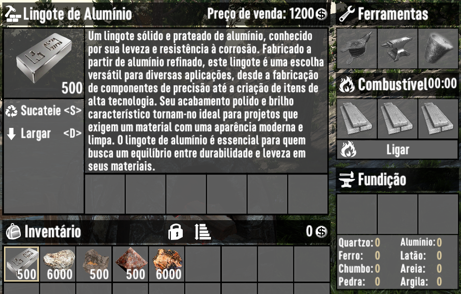
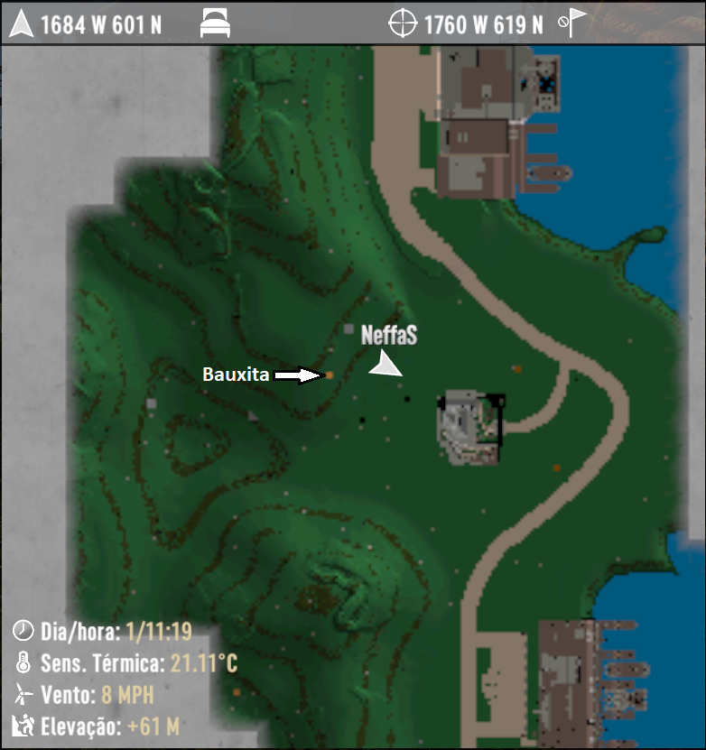
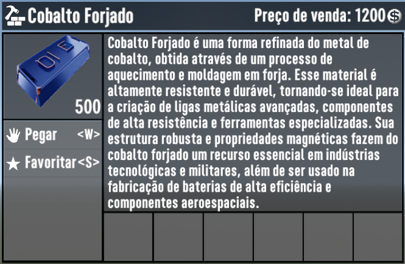

# Neffas' Mining & Craft - Mining Overhaul for 7 Days to Die (V1.0) - In Development

Mining &amp; Craft is a mod for 7 Days to Die that enhances mining with new ores, items, and tools.
Discover unique textures for each ore, making identification easy. Improves crafting with existing
benches for a more realistic experience. Special thanks to ocbMaurice for the essential OCB MicroSplat mods!

## Description

Welcome to Mining & Craft, the mod that takes the mining and crafting system in 7 Days to Die to a whole new level!
Explore the underground like never before with a range of new ores, transforming how you gather resources and craft items.

Thanks to the amazing [OCB MicroSplat][1] and [OCB MicroSplat Ore Voxels][2] mods created by ocbMaurice, each ore in
Mining & Craft features its own unique texture, allowing you to instantly identify what you've discovered and enhancing
gameplay immersion. We are deeply grateful for ocbMaurice's essential contribution to making this mod possible.

In addition to new materials, the mod introduces a variety of items and tools that expand the use of existing workbenches, making the crafting process even more engaging and realistic. Now, each resource plays a crucial role in crafting items and tools, bringing your survival experience closer to reality.

Whether you play solo or on dedicated servers, Mining & Craft offers a new level of depth, challenging players to adapt their survival and crafting strategies.

Discover, gather, and create like never before. Mining & Craft is your gateway to a richer and more detailed experience in 7 Days to Die.

## Details

### Quartz Ore

**Description:**
Quartz Ore is a valuable mineral extracted from deep veins in the earth. Known for its resilience and versatility, quartz is frequently used in advanced manufacturing processes. Its crystalline properties make it essential for creating electronics, high-precision components, and decorative jewelry. Additionally, pure gold veins can be found embedded within quartz, enhancing its desirability.

You need to dig deeper to find Quartz Ore

**Block Properties:**
- **Block Name:** `terrOreQuartz`
- **Map Color:** RGB(75,75,75)
- **Tags:** ore, deepOre
- **Drops:** 
  - `resourceQuartzOre` (105 units)
  - `resourceIronOre` (probability 0.15, 25 units)
  - `resourcePotassiumNitratePowder` (probability 0.25, 25 units)
  - `resourceRockSmall` (probability 0.6, 25 units)
  - `resourceSilverNugget` (probability 0.05, 1 unit)
  - `resourceGoldNugget` (probability 0.035, 1 unit)
  - `resourceRawDiamond` (probability 0.015, 1 unit)

Quartz Ore has veins of gold. You have a higher chance of finding precious ores when mining Quartz.

**Item Properties:**
- **Resource Name:** `resourceQuartzOre`
- **Stack Number:** 6000
- **Economic Value:** 30
- **Crafting Ingredient Time:** 0.2 seconds

**Credits:**
Ore texture image by [rawpixel.com - Freepik][3]

___

### Bauxite Ore

**Description:**
Bauxite Ore is a raw mineral found in large rocky deposits and serves as the primary source of aluminum. Rich in aluminum oxides, it needs to be refined in a forge to extract pure aluminum, which is essential for crafting lightweight tools and technological components. Mining bauxite is the initial step in aluminum production, making it a crucial resource for survivors aiming to enhance their constructions and equipment.

Bauxite ore is the main source of aluminum.

**Block Properties:**
- **Block Name:** `terrOreBauxite`
- **Map Color:** RGB(186, 126, 65)
- **Tags:** ore, deepOre
- **Drops:** 
  - `resourceBauxiteOre` (22 units)
  - `resourceScrapIron` (probability 0.15, 25 units)
  - `resourceRockSmall` (probability 0.6, 25 units)

**Item Properties:**
- **Resource Name:** `resourceBauxiteOre`
- **Stack Number:** 6000
- **Economic Value:** 25
- **Crafting Ingredient Time:** 0.2 seconds

You can process Bauxite Ore in the forge to refine aluminum into its purest form.

**Credits:**
Ore texture image by [ededchechine on Freepik][4]

___

Each ore has its own color on the map. Of course, some colors can get mixed up, especially shades of gray, but there's not much I can do about that.

___

### Cobalt Ore

**Cobalt Ore** is a valuable resource introduced into the game to expand mining and crafting possibilities for advanced items. This rare ore is found deep within challenging biomes such as the Wasteland and Snow, adding an extra layer of complexity and reward for players who venture into these regions.

## General Characteristics

### Ore Name:
- **Cobalt Ore**

### IDs and Associated Names:
- `resourceCobaltOre`: Cobalt Ore
- `resourceCobaltOreBundle`: Cobalt Ore Bundle
- `terrOreCobalt`: Cobalt Ore Block
- `oreCobaltBoulder`: Cobalt Ore Boulder
- `resourceScrapCobalt`: Scrap Cobalt
- `resourceForgedCobalt`: Forged Cobalt

### Ore Description:
**Cobalt Ore** is a rare and highly valued metal due to its technological and industrial properties. Found deep within the Snow and Wasteland biomes, mining it requires careful planning and the appropriate tools. Once extracted, cobalt can be refined in a forge to produce **Forged Cobalt**, essential for crafting high-performance tools, weapons, and components. Additionally, mining cobalt offers a chance to uncover precious gems such as raw diamonds, emeralds, sapphires, rubies, and amethysts, making the exploration even more rewarding.

---

## Related Blocks and Items

### **Block terrOreCobalt** (Cobalt Ore Block):
- **Appearance:** A dark blue metallic rock that stands out against its surroundings.
- **Properties:**
  - **Material:** MoreMetal
  - **Location:** Found in Snow and Wasteland biomes, requiring deep excavation.
  - **Hardness:** High, requiring advanced tools to mine.
- **Map Color:**
  - `Map.Color`: 31, 80, 184 (blue)
- **Drops:**
  - 22 units of Cobalt Ore.
  - Chance to obtain additional resources like **Iron Ore**, **Silver Nuggets**, and even **Raw Diamonds**.

### **Block oreCobaltBoulder** (Cobalt Ore Boulder):
- **Appearance:** Similar to the cobalt ore block, but in a loose rock form, often found on remote surfaces.
- **Drops:**
  - 22 units of Cobalt Ore.
  - Chance to obtain other resources such as **Potassium Nitrate Powder**, **Iron Ore**, and small amounts of **Silver Nuggets** and **Raw Diamonds**.

### **Block terrOreStoneCobaltRandom** (Random Cobalt Veins):
- **Appearance:** Found randomly mixed with other rocky materials.
- **Location:** Can be found as veins mixed with other stone blocks in biomes such as Wasteland, Snow, Pine Forest, and Desert.

---

## Related Materials and Items

### **Cobalt Ore**:
- **Description:** Raw material extracted from rocky formations. It can be refined into **Forged Cobalt** or scrapped into **Scrap Cobalt**.

### **Scrap Cobalt** (resourceScrapCobalt):
- **Description:** Fragments obtained by processing cobalt ore. Used in various crafting recipes.

### **Forged Cobalt** (resourceForgedCobalt):
- **Description:** A highly durable refined metal, obtained after smelting cobalt ore. Essential for crafting advanced items like armor, weapons, and high-durability tools.

---

## Material Properties

### **Cobalt Material (cobalt)**:
- **Damage Category:** Metal
- **Hardness:** 1
- **XP Granted:** 2
- **Walking Sound:** Metal
- **Weight:** 20

### **Cobalt Ore Material (MresourceCobalt)**:
- **Damage Category:** Metal
- **XP Granted:** 1.6
- **Forge Category:** Cobalt

### **Forged Cobalt Material (MresourceForgedCobalt)**:
- **XP Granted:** 10

---

## Challenges and Rewards

Mining cobalt is a complex and dangerous task. Players will need to dig deep, especially in hostile biomes such as the Wasteland and Snow, where cobalt is more abundant. However, the rewards justify the effort: besides obtaining one of the game’s most valuable metals, players may discover precious gems and other rare resources.

By refining **Cobalt Ore** into **Forged Cobalt**, players can craft top-tier items that are essential for survival and success in harsh environments. Cobalt is particularly useful for the production of high-efficiency batteries, high-performance tools, and components for technological industries.

**Cobalt Ore** is a key resource for players looking to master advanced crafting in **7 Days to Die**. Its rarity, combined with the difficulty of extraction, makes it one of the game’s most coveted raw materials. Only those who are well-prepared will be able to explore its full potential and reap the rewards of its technological and industrial properties.

___

### Ore Integration and Crafting Recipes

All minerals have been properly added to the map's spawn points and have been integrated as accepted materials in forges. This ensures that every mineral is available for use throughout the game. 

Please note that crafting recipes will only be updated upon the project's completion. Until then, the current recipes will remain unchanged.

***

[1]: https://github.com/OCB7D2D/OcbMicroSplat
[2]: https://github.com/OCB7D2D/OcbMicroSplatOreVoxels
[3]: https://www.freepik.com/free-photo/gray-gold-marble-textured-background_17592797.htm
[4]: https://www.freepik.com/free-photo/background-red-granite-details-old-foundation-medieval-scandinavian-house-from-granite-stones-held-together-with-mortar-natural-background-idea-interior-wallpaper_28877243.htm