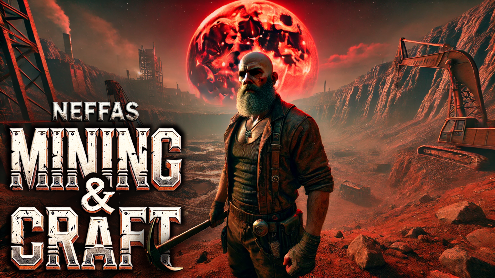
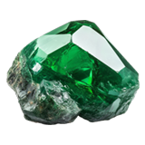
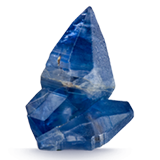
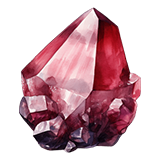
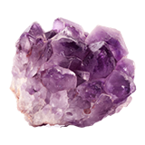

# NeffaS' Mining & Craft - Mining Overhaul for 7 Days to Die (V1.0) - In Development

**NeffaS' Mining & Craft** is a mod for 7 Days to Die that expands the mining and crafting systems with new ores, items, and tools. This mod introduces unique textures for each ore, enhancing resource identification and gameplay immersion. Special thanks to [ocbMaurice](https://github.com/OCB7D2D) for the essential OCB MicroSplat mods, which significantly contribute to the visual and functional aspects of the mod.

## Description

NeffaS' Mining & Craft takes the mining and crafting experience in 7 Days to Die to a new level. Explore the depths with a range of newly added ores and minerals, each featuring unique textures for easy identification. The mod integrates these new materials into existing crafting benches, adding realism and depth to the survival experience.

**Key Features:**
- **New Ores and Minerals:** Includes Quartz Ore, Bauxite Ore, and Cobalt Ore, each with unique properties and uses.
- **Precious Gems:** Introduces raw gems such as Emeralds, Sapphires, Rubies, and Amethysts as rare drops, adding economic value to mining activities.
- **Crafting Enhancements:** Expanded crafting options utilizing new ores and materials.

## Details

### Quartz Ore
- **Description:** A versatile mineral used in advanced manufacturing and electronics. Found deep underground with occasional gold veins.
- **Drops:** Quartz Ore, Iron Ore, Gold Nuggets, and more.

Quartz Ore has veins of gold. You have a higher chance of finding precious ores when mining Quartz.

### Bauxite Ore
- **Description:** The primary source of aluminum, crucial for crafting lightweight tools and components. Found in large rock deposits.
- **Drops:** Bauxite Ore, Scrap Iron, and more.

Bauxite ore is the main source of aluminum.

### Cobalt Ore
- **Description:** A rare metal found in Snow and Wasteland biomes. Essential for high-performance tools and components. Mining cobalt may also yield precious gems.
- **Drops:** Cobalt Ore, Iron Ore, Silver Nuggets, and precious gems.

Cobalt ore is found in deeper layers of the ground, which requires the player to dig deeper to farm the ore. This ore is exclusive to the snow and wasteland biomes.

### Copper Ore
- **Description:** A versatile and common metal used in various industrial applications. Copper ore is found in several biomes and is essential for crafting electrical components and plumbing systems.
- **Drops:** Copper Ore, Scrap Copper, and more.

Copper ore is commonly used for creating various tools and components. Its abundance makes it a crucial resource in the game.

### Copper Scrap
- **Description:** Small fragments of copper ore that are useful for crafting and recycling. These fragments are rich in value and can be refined into pure copper.
- **Drops:** Scrap Copper, small fragments.

Copper scrap is valuable for refining and crafting, adding depth to the resource management in the game.

### Zinc Ore
- **Description:** A crucial metal used for creating alloys and various tools. Zinc ore is commonly found in various biomes, including forests and deserts.
- **Drops:** Zinc Ore, Scrap Iron, and more.

Zinc ore is essential for crafting and alloy creation, offering diverse usage in the game.

### Precious Gems
- **Raw Emerald, Sapphire, Ruby, Amethyst:** Found as rare drops while mining specific ores. Currently have economic value but no additional crafting functionality.

   

## Credits
- **Textures for Quartz Ore:** [rawpixel.com - Freepik](https://www.freepik.com/free-photo/gray-gold-marble-textured-background_17592797.htm)
- **Textures for Bauxite Ore:** [ededchechine on Freepik](https://www.freepik.com/free-photo/background-red-granite-details-old-foundation-medieval-scandinavian-house-from-granite-stones-held-together-with-mortar-natural-background-idea-interior-wallpaper_28877243.htm)
- **Special Thanks:** [ocbMaurice](https://github.com/OCB7D2D) for the OCB MicroSplat and OCB MicroSplat Ore Voxels mods.

## Integration and Future Updates

All new minerals are integrated into the map’s spawn points and forges. Crafting recipes will be updated in future releases. Stay tuned for more enhancements and features!

For more details and updates, please refer to the mod's documentation and changelogs.

Happy mining and crafting!
